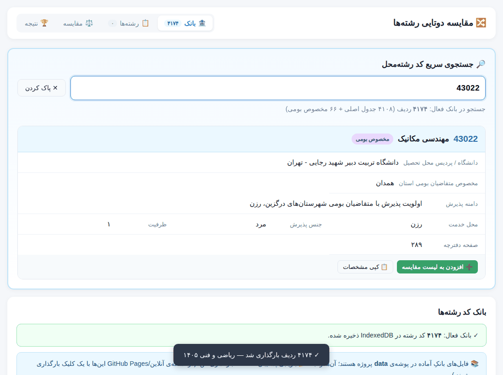
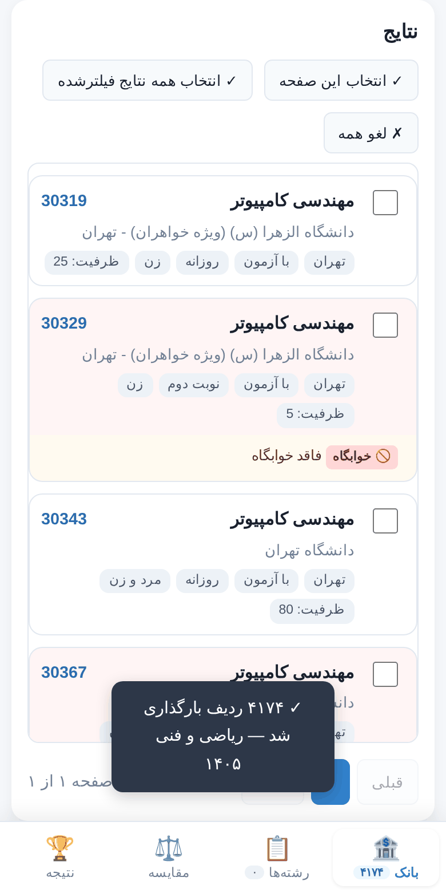
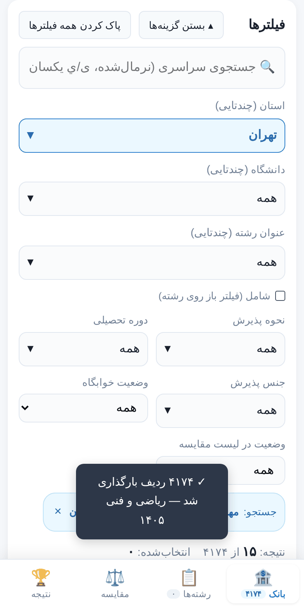
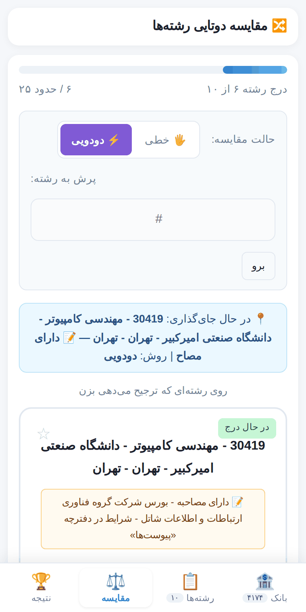
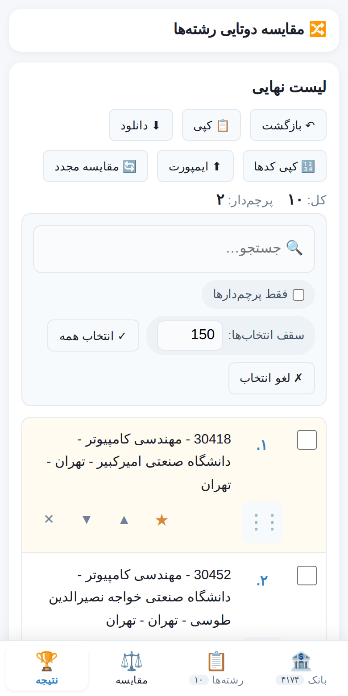
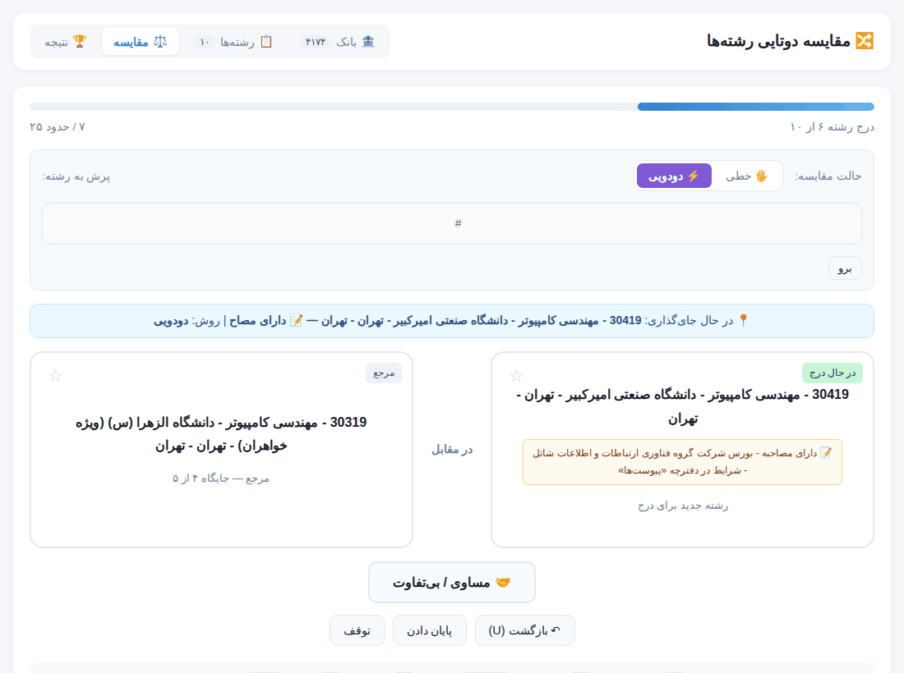

<div dir="rtl">

# 🔀 انتخاب رشته — مقایسه دوتایی رشته‌ها

**ابزاری رایگان، آفلاین و بدون سرور برای کسی که باید از میان هزاران کد رشته‌محل، فهرست اولویت‌دار انتخاب رشته‌ی کنکور را بسازد.**
بانک کدها را جستجو و فیلتر می‌کنی، رشته‌های مورد نظرت را برمی‌داری، و ابزار با پرسیدن سؤال‌های ساده‌ی «کدام را بیشتر می‌خواهی؟» ترتیب نهایی را برایت می‌سازد.

<sub>🇬🇧 **English summary:** a single-file, offline, Persian (RTL) web app that helps you build a ranked priority list for Iran's university entrance ("Konkur") major-selection stage. Search/filter a bank of program codes, shortlist programs, then rank them via pairwise comparisons (insertion sort driven by your own A-vs-B choices). Mobile-friendly, no backend, data stays in your browser. Open `index.html` — that's it.</sub>

<p align="center">
  
</p>

---

## فهرست

1. [این ابزار چیست و چه مشکلی را حل می‌کند؟](#این-ابزار-چیست-و-چه-مشکلی-را-حل-میکند)
2. [امکانات](#امکانات)
3. [تصاویر](#تصاویر)
4. [شروع سریع](#شروع-سریع)
5. [راهنمای استفاده قدم‌به‌قدم](#راهنمای-استفاده-قدمبهقدم)
6. [مقایسه‌ی دوتایی: چرا و چطور؟](#مقایسهی-دوتایی-چرا-و-چطور)
7. [فرمت داده‌ها و ساخت بانک](#فرمت-دادهها-و-ساخت-بانک)
8. [ساختار پروژه](#ساختار-پروژه)
9. [انتشار روی GitHub Pages](#انتشار-روی-github-pages)
10. [حریم خصوصی](#حریم-خصوصی)
11. [محدودیت‌ها و سلب مسئولیت](#محدودیتها-و-سلب-مسئولیت)
12. [نقشه‌ی راه](#نقشهی-راه)
13. [مشارکت](#مشارکت)
14. [مجوز](#مجوز)

---

## این ابزار چیست و چه مشکلی را حل می‌کند؟

در مرحله‌ی انتخاب رشته‌ی آزمون سراسری، هر متقاضی باید فهرستی از کد رشته‌محل‌ها را **به ترتیب اولویت** ثبت کند. دفترچه‌ی راهنما هزاران ردیف دارد (دانشگاه، رشته، دوره، سهمیه، ظرفیت، توضیحات خوابگاه و …)، و سقفی برای تعداد انتخاب‌ها وجود دارد (سقف دقیق را از دفترچه‌ی سال خودت بخوان؛ در ابزار قابل تنظیم است و پیش‌فرضش ۱۵۰ است).

دو کار سخت اینجا هست:

1. **پیدا کردن**: از میان چند هزار ردیف، آن‌هایی را که به درد من می‌خورند پیدا کنم (استان، دانشگاه، رشته، نوع دوره، خوابگاه، …).
2. **مرتب کردن**: ده‌ها یا صدها گزینه را چطور اولویت‌بندی کنم، وقتی نمی‌توانم به هر کدام یک «نمره‌ی» دقیق بدهم؟

این پروژه برای هر دو کار ساخته شده است:

| کار | ابزار پاسخ می‌دهد با |
|---|---|
| پیدا کردن | بانک قابل جستجو و فیلتر چندگانه، جستجوی سریع با کد رشته، علامت‌گذاری رشته‌های اضافه‌شده |
| مرتب کردن | مقایسه‌ی دوتایی: هر بار فقط دو گزینه می‌بینی و یکی را انتخاب می‌کنی؛ ابزار از روی پاسخ‌هایت فهرست کامل را می‌سازد |
| تحویل | خروجی متنی و فهرست کدها، آماده‌ی وارد کردن در سامانه‌ی انتخاب رشته |

> ⚠️ ابزار **هیچ چیزی را در سایت سازمان سنجش ثبت نمی‌کند** و احتمال قبولی هم محاسبه نمی‌کند. فقط به تو کمک می‌کند ترجیحات خودت را منظم کنی. (جزئیات در [محدودیت‌ها](#محدودیتها-و-سلب-مسئولیت))

## امکانات

**بانک رشته‌ها**
- جستجوی سریع با کد رشته‌محل (مثلاً `30075`) یا بخشی از نام رشته/دانشگاه، با نمایش کارت کامل مشخصات
- فیلتر **چندانتخابی** روی استان، دانشگاه، عنوان رشته، نحوه پذیرش، دوره تحصیلی و جنس پذیرش (با جستجو داخل هر فیلتر و «انتخاب همه‌ی نتایج»)
- فیلتر وضعیت خوابگاه و فیلتر «اضافه‌شده / اضافه‌نشده به لیست»
- جستجوی سراسری نرمال‌شده (ی/ي، ک/ك و ارقام فارسی/انگلیسی یکسان‌اند)
- نمایش کامل توضیحات هر رشته (بدون بریده شدن)
- رشته‌ی اضافه‌شده به لیست همیشه با تیک سبز و برچسب «✓ در لیست» دیده می‌شود
- پشتیبانی از ردیف‌های مخصوص بومی (دامنه‌ی پذیرش، محل خدمت، استان بومی)

**مرتب‌سازی با مقایسه‌ی دوتایی**
- حالت **دودویی** (سریع) و **خطی** (دقیق‌تر)، با امکان تعویض روش وسط کار
- دکمه‌ی «مساوی»، بازگشت (Undo)، پرش، پرچم ★ برای رشته‌های مهم/مردد
- **مقایسه‌ی مجدد** روی لیست مرتب‌شده: بازبینی کامل، درج فقط رشته‌های جدید، یا از صفر
- ذخیره‌ی خودکار پیشرفت؛ هر وقت برگردی از همان‌جا ادامه می‌دهی

**لیست نهایی**
- جابه‌جایی با کشیدن (ماوس و لمس)، دکمه‌های ▲▼، تغییر جایگاه با شماره، عملیات گروهی، Undo
- خط مرز قابل تنظیم (سقف تعداد انتخاب‌ها)
- کپی/دانلود متنی، **کپی فقط کدها**، و **ایمپورت** همان فایل دانلودشده

**ساخت و جابه‌جایی داده**
- بارگذاری بانک از JSON، CSV و Excel؛ تشخیص خودکار ستون‌ها با نقشه‌برداری دستی در صورت نیاز
- بانک‌های آماده با یک کلیک (نسخه‌ی آنلاین)، خروجی گرفتن از بانک، پشتیبان کامل (بانک + لیست + وضعیت مقایسه)

**موبایل**
- طرح واکنش‌گرا: نوار پایینی برای تب‌ها، کارت به‌جای جدول، فیلترهای جمع‌شونده، کشیدن با لمس، فرم‌های بدون زوم خودکار iOS

## تصاویر

<p align="center">
  
  &nbsp;
  
  &nbsp;
  
  &nbsp;
  
</p>

<p align="center">
  
</p>

## شروع سریع

### الف) آنلاین (پیشنهادی)
اگر مالک مخزن [GitHub Pages](#انتشار-روی-github-pages) را فعال کرده باشد، آدرس زیر را باز کن و در تب «بانک» روی «بارگذاری» بزن:

```
https://<username>.github.io/<repo>/
```

### ب) آفلاین
1. این مخزن را دانلود کن (`Code ← Download ZIP`) و از حالت فشرده خارج کن.
2. فایل `index.html` را در مرورگر باز کن. نیازی به نصب، سرور یا اینترنت نیست.
3. در تب «بانک»، فایل `data/riazi-1405.json` را با دکمه‌ی **«📂 بازیابی پشتیبان JSON»** بارگذاری کن.

> 💡 فایل را از داخل مرورگرِ داخلی پیام‌رسان‌ها (تلگرام، اینستاگرام و …) باز نکن؛ این مرورگرها ذخیره‌سازی را محدود می‌کنند. آن را در Chrome/Safari/Firefox باز کن.

## راهنمای استفاده قدم‌به‌قدم

### ۱) بارگذاری بانک
تب **🏦 بانک** ← یکی از این‌ها:
- **بانک‌های آماده** (فقط نسخه‌ی آنلاین): روی «بارگذاری» بزن.
- **📂 بازیابی پشتیبان JSON**: فایل‌های `data/*.json` (فایل بانک) یا پشتیبان کامل.
- **📊 بارگذاری فایل اکسل / CSV**: فایل CSV/Excel؛ بعد از پیش‌نمایش «تأیید و ذخیره» را بزن.

اگر قبلاً بانکی داشته باشی، ابزار می‌پرسد **جایگزین** شود یا **به بانک فعلی اضافه** شود. در هر دو حالت لیست و نتیجه‌ی تو دست نمی‌خورد.

### ۲) جستجو و فیلتر
- کادر «🔎 جستجوی سریع» با کد یا بخشی از نام کار می‌کند.
- در بخش «فیلترها» هر چند استان/دانشگاه/رشته را همزمان انتخاب کن. (در موبایل با «گزینه‌های بیشتر» باز می‌شود.)
- با انتخاب استان، فهرست دانشگاه‌ها فقط همان استان‌ها را نشان می‌دهد.

### ۳) افزودن به لیست
ردیف‌ها را تیک بزن و «➕ افزودن به لیست مقایسه» را بزن. رشته‌ی اضافه‌شده تیک سبز و برچسب «✓ در لیست» می‌گیرد و دیگر انتخاب‌شدنی نیست. می‌توانی رشته‌ها را دستی هم اضافه کنی یا متن را از PDF paste کنی (تب «📋 رشته‌ها»).

### ۴) مقایسه
تب **⚖️ مقایسه** ← «شروع مقایسه». هر بار دو رشته می‌بینی؛ **روی رشته‌ای که ترجیح می‌دهی بزن** (یا از کیبورد: `→` ترجیح راست، `←` ترجیح چپ، `Space` مساوی، `U` بازگشت، `F` پرچم، `Esc` توقف). توضیح دقیق روش در [بخش بعد](#مقایسهی-دوتایی-چرا-و-چطور) آمده است.

### ۵) نتیجه و تنظیم نهایی
تب **🏆 نتیجه**: فهرست مرتب‌شده را می‌بینی. می‌توانی بکشی، ▲▼ بزنی، روی شماره بزنی و جایگاه را تغییر بدهی، ★ بگذاری، یا گروهی حذف/جابه‌جا کنی. اگر رشته‌ی جدیدی اضافه شد، همین‌جا هشدار با دکمه‌ی «درج با مقایسه» می‌بینی.

### ۶) خروجی
- **📋 کپی** / **⬇ دانلود**: متن شماره‌دار (رشته‌های ★دار با ★ شروع می‌شوند).
- **🔢 کپی کدها**: فقط کدها، به ترتیب، هر کد در یک خط؛ برای وارد کردن در سامانه.
- **⬆ ایمپورت**: فایل دانلودشده (یا فقط فهرست کدها) را دوباره بارگذاری می‌کند؛ ترتیب و پرچم‌ها برمی‌گردند.

### ۷) پشتیبان‌گیری
داده‌ها فقط در **همین مرورگر** ذخیره می‌شوند. اگر تاریخچه/داده‌ی سایت را پاک کنی یا مرورگر عوض کنی، از بین می‌روند. بعد از هر جلسه‌ی کاری «💾 پشتیبان کامل» را بگیر و فایل را جایی نگه دار.

---

## مقایسه‌ی دوتایی: چرا و چطور؟

### چرا دو رشته دو رشته مقایسه می‌شوند؟

فرض کن ۸۰ گزینه داری. دو راه معمول:

- **نمره دادن به هر گزینه** (مثلاً ۱ تا ۱۰): سخت و ناپایدار است. «۷» برای رشته‌ی اول امروز با «۷» برای رشته‌ی آخر فردا یکی نیست؛ بین «۷» و «۸» فرق معنادار حس نمی‌شود؛ و گزینه‌ها بدون مقایسه‌ی مستقیم با هم سنجیده می‌شوند.
- **یک‌جا مرتب کردن**: ذهن نمی‌تواند ۸۰ چیز را همزمان نگه دارد و ترتیب بدهد.

اما انسان در مقایسه‌ی **نسبی** خوب است: «آیا مهندسی برق دانشگاه A را به علوم کامپیوتر دانشگاه B ترجیح می‌دهم؟» سؤالی است که معمولاً می‌شود در چند ثانیه جواب داد. مقایسه‌ی دوتایی یک تصمیم بزرگ و مبهم را به **دنباله‌ای از سؤال‌های کوچک و روشن** تبدیل می‌کند، و کل پاسخ‌ها به یک ترتیب کامل تبدیل می‌شود.

این ایده تازه نیست: «قانون قضاوت مقایسه‌ای» ترستون (Thurstone) در روان‌سنجی و روش «تحلیل سلسله‌مراتبی» (AHP) در تصمیم‌گیری چندمعیاره هر دو بر مقایسه‌ی دوتایی استوارند. (این دو را فقط به‌عنوان پیشینه‌ی ایده ذکر می‌کنم؛ این ابزار نه آن‌ها را پیاده کرده و نه از آن‌ها نمره می‌سازد.)

### الگوریتم: مرتب‌سازی درجی (Insertion Sort) با «قاضیِ» انسانی

ابزار یک الگوریتم مرتب‌سازی کلاسیک اجرا می‌کند و به‌جای اینکه کامپیوتر دو مقدار را مقایسه کند، **خودت** قاضی هر مقایسه‌ای:

1. رشته‌ی اول در لیست مرتب‌شده می‌نشیند.
2. رشته‌ی بعدی را بردار («رشته‌ی در حال درج») و جای درستش را در لیستِ مرتب‌شده‌ی فعلی پیدا کن.
3. هر بار آن را با یک رشته‌ی «مرجع» از همان لیست مقایسه می‌کنی؛ پاسخت می‌گوید جایش بالاتر است یا پایین‌تر.
4. وقتی جایش مشخص شد، درج می‌شود و رشته‌ی بعدی نوبت می‌گیرد.
5. بعد از درج همه، لیست کامل و مرتب است.

دو حالت برای پیدا کردن جا وجود دارد:

#### 🔹 حالت خطی (دقیق‌تر، پرمقایسه)
رشته‌ی جدید را با رشته‌ی **درست بالای خودش** مقایسه می‌کنی. اگر ترجیحش بدهی یک پله بالا می‌رود و با رشته‌ی بعدیِ بالاتر مقایسه می‌شود؛ تا جایی که یک رشته را بر آن ترجیح ندهی. همان‌جا می‌نشیند.
- **مزیت:** همیشه با همسایه‌ی مستقیمش مقایسه می‌شود؛ بنابراین هر جفتِ مجاور در لیست نهایی دست‌کم یک‌بار مستقیماً سنجیده شده است. اگر یک قضاوت اشتباه کنی، خطایش محلی می‌ماند.
- **هزینه:** برای لیستِ تصادفی به‌طور میانگین حدود n²/4 مقایسه.

#### 🔸 حالت دودویی (سریع)
به‌جای پیمودن یکی‌یکیِ لیست، **جستجوی دودویی** می‌کند: رشته‌ی جدید با رشته‌ی میانیِ لیست مقایسه می‌شود، بعد نیمه‌ی درست انتخاب می‌شود و دوباره با میانیِ آن نیمه … تا جا پیدا شود.
- **مزیت:** درج k‌امین رشته حداکثر ⌈log₂k⌉ مقایسه می‌خواهد؛ کل کار حدود n·log₂n.
- **هزینه:** وابسته به «ترایایی بودن» (توضیح در پایین) است؛ یک قضاوت متناقض می‌تواند رشته را کمی دورتر از جای واقعی‌اش بنشاند.

#### تعداد تقریبی مقایسه‌ها

| تعداد رشته‌ها (n) | دودویی (حداکثر) | خطی (میانگین) | بازبینی خطی لیست مرتب (n−۱) |
|---:|---:|---:|---:|
| ۱۰ | ۲۵ | ≈ ۲۲ | ۹ |
| ۳۰ | ۱۱۹ | ≈ ۲۱۸ | ۲۹ |
| ۵۰ | ۲۳۷ | ≈ ۶۱۲ | ۴۹ |
| ۱۰۰ | ۵۷۳ | ≈ ۲٬۴۷۵ | ۹۹ |
| ۱۵۰ | ۹۴۵ | ≈ ۵٬۵۸۸ | ۱۴۹ |

(ابزار همین برآورد را بالای صفحه‌ی مقایسه نشان می‌دهد؛ «حدود» است چون به ترتیب اولیه و پاسخ‌هایت بستگی دارد.)

**توصیه‌ی عملی:** برای لیست‌های بلند اول حالت **دودویی** را اجرا کن، بعد با «مقایسه‌ی مجدد ← بازبینی کامل» (خطی) فقط n−۱ مقایسه‌ی تأییدی انجام بده و هر جا ترتیب به نظرت اشتباه آمد اصلاحش کن. این ترکیب هم سریع است، هم دقیق.

### «مساوی / بی‌تفاوت» یعنی چه؟
اگر دو رشته را برابر می‌دانی، رشته‌ی در حال درج **زیر** رشته‌ی مرجع قرار می‌گیرد (ترتیب اولیه حفظ می‌شود). اگر بعداً برایت مهم شد، در لیست نهایی جابه‌جایشان کن.

### دکمه‌ها و قابلیت‌های حین مقایسه
- **بازگشت (U):** آخرین پاسخ را پس می‌گیرد (تا ۳۰۰ مرحله).
- **تعویض روش:** وسط کار می‌توانی بین خطی و دودویی جابه‌جا شوی.
- **پرش:** اگر می‌دانی رشته‌های اول لیست از قبل مرتب‌اند، می‌توانی به رشته‌ی شماره‌ی n بپری. (توجه: رشته‌های قبل از n «مرتب‌شده» فرض می‌شوند.)
- **پایان دادن:** مقایسه را با ترتیب فعلی تمام می‌کند؛ رشته‌های مقایسه‌نشده به همان ترتیب اولیه ته لیست می‌مانند.
- **توقف (Esc):** به تب «رشته‌ها» برمی‌گردد و پیشرفت ذخیره می‌ماند؛ بعداً از همان‌جا ادامه می‌دهی.
- **★ پرچم:** فقط یک علامت شخصی است («مهم»، «مردد»، «بعداً چک شود») و روی ترتیب اثری ندارد.

### مقایسه‌ی مجدد
وقتی لیست نتیجه داری و دوباره «مقایسه» می‌زنی، نتیجه پاک **نمی‌شود**. پنجره‌ای باز می‌شود:

| گزینه | کاربرد |
|---|---|
| 🔍 بازبینی کامل لیست مرتب‌شده | هر رشته با رشته‌ی بالاییِ خودش دوباره مقایسه می‌شود. اگر ترتیب درست باشد فقط n−۱ مقایسه لازم است؛ هر جا نظرت عوض شد جایش را عوض می‌کنی. |
| ➕ فقط درج رشته‌های جدید | لیست مرتب‌شده‌ی فعلی سر جایش می‌ماند؛ فقط رشته‌های تازه‌اضافه‌شده در جای درستشان درج می‌شوند. |
| ↺ از صفر | همه چیز از اول مقایسه می‌شود؛ نتیجه‌ی فعلی تا پایان مقایسه‌ی جدید حفظ می‌شود. |
| ▶ ادامه | اگر مقایسه‌ی نیمه‌تمامی داری. |

### چه معیاری؟
ابزار معیاری را تحمیل نمی‌کند؛ **خودت** هر بار تصمیم می‌گیری. بهتر است قبل از شروع، معیارها و اولویت‌هایت را (علاقه به رشته، شهر، دانشگاه، خوابگاه، شهریه، آینده‌ی شغلی، شانس قبولی، …) مشخص کنی و هر بار با همان معیارها جواب بدهی؛ وگرنه پاسخ‌ها ناسازگار می‌شوند.

### فرض‌ها و محدودیت‌های روش
- **ترایایی بودن:** فرض می‌شود اگر A را به B و B را به C ترجیح می‌دهی، A را به C هم ترجیح می‌دهی. ابزار تناقض‌های تو را **تشخیص نمی‌دهد**؛ برای همین بازبینی نهایی را توصیه می‌کنم.
- **فقط ترتیب، نه فاصله:** خروجی یک رتبه‌بندی است. نمی‌گوید رشته‌ی اول «چقدر» از دومی بهتر است.
- **چندمعیاره نیست:** اوزان و نمره‌ای محاسبه نمی‌شود؛ ترجیح نهایی کاملاً از قضاوت خودت می‌آید.

---

## فرمت داده‌ها و ساخت بانک

بانک یک فایل ساده است. هر ردیف یک کد رشته‌محل:

```json
{
  "format": "entekhab-reshte-bank",
  "version": 1,
  "meta": { "title": "ریاضی و فنی ۱۴۰۵", "group": "ریاضی و فنی", "year": 1405, "rows": 4174 },
  "bank": [
    {
      "code": "30001", "major": "مهندسی برق", "university": "دانشگاه …", "province": "…",
      "admission": "با آزمون", "degree": "روزانه", "gender": "مرد و زن",
      "capFirst": "41", "capSecond": "", "capFemale": "", "capMale": "",
      "notes": "فاقد خوابگاه", "star": false, "page": "43"
    }
  ]
}
```

- فقط `code` و `major` الزامی‌اند؛ بقیه‌ی فیلدها اختیاری‌اند.
- CSV هم پذیرفته می‌شود (ستون‌ها با نام فارسی تشخیص داده می‌شوند، حتی بدون ستون استان/دانشگاه).
- مشخصات کامل فرمت‌ها (JSON، CSV، پشتیبان کامل، manifest، فرمت فایل لیست نهایی): [`docs/data-format.md`](docs/data-format.md)

### بانک‌های موجود در مخزن

| فایل | محتوا |
|---|---|
| `data/riazi-1405.json` / `.csv` | گروه آزمایشی ریاضی و فنی — ۴٬۱۷۴ ردیف (۴٬۱۰۸ ردیف جدول اصلی + ۶۶ ردیف مخصوص بومی) |

> ⚠️ این داده‌ها از PDF دفترچه استخراج شده‌اند و **ممکن است خطا یا افتادگی داشته باشند**. قبل از ثبت نهایی، کدها را حتماً با دفترچه‌ی رسمی و سامانه‌ی سازمان سنجش تطبیق بده.

### ساخت بانک از PDF دفترچه
اسکریپت [`scripts/extract_booklet.py`](scripts/extract_booklet.py) جدول‌های یک PDF دارای لایه‌ی متنی را استخراج می‌کند و بانک را مستقیم در فرمت بالا می‌سازد. استخراج همراه با اعتبارسنجی با یک موتور مستقل است (تعداد کدها در هر صفحه، متن هر ردیف، یکتایی کدها). **این اسکریپت فعلاً فقط روی دفترچه‌ی ۱۴۰۴ گروه ریاضی و فنی آزمایش شده**؛ نحوه‌ی کار و نکته‌های فنی در [`docs/extraction-guide.md`](docs/extraction-guide.md) توضیح داده شده است و نسخه‌ی عمومی‌تر در [نقشه‌ی راه](#نقشهی-راه) است.

```bash
pip install pdfplumber            # و poppler-utils برای اعتبارسنجی
python scripts/extract_booklet.py book.pdf --calibrate        # گرفتن مختصات ستون‌ها
python scripts/extract_booklet.py book.pdf --out out --title "ریاضی و فنی ۱۴۰۴" --year 1404
```

## ساختار پروژه

```
.
├── index.html               # کل ابزار (یک فایل، بدون وابستگی ساخت)
├── data/
│   ├── manifest.json        # فهرست بانک‌های آماده (برای دکمه‌ی «بارگذاری» در نسخه‌ی آنلاین)
│   ├── riazi-1405.json      # بانک (فرمت JSON)
│   └── riazi-1405.csv       # همان بانک (CSV)
├── scripts/
│   └── extract_booklet.py   # استخراج بانک از PDF دفترچه
├── docs/
│   ├── data-format.md       # مشخصات فرمت‌های داده
│   ├── extraction-guide.md  # شرح فنی روش استخراج از PDF
│   └── screenshots/
└── LICENSE
```

ابزار یک صفحه‌ی HTML با CSS و JavaScript خام است؛ ساخت یا نصب لازم ندارد. تنها منابع بیرونی: فونت وزیرمتن (Google Fonts؛ با نبودنش فونت سیستم جایگزین می‌شود) و کتابخانه‌ی SheetJS که **فقط وقتی** فایل Excel انتخاب کنی از اینترنت بارگذاری می‌شود (برای CSV/JSON لازم نیست).

## انتشار روی GitHub Pages

1. مخزن را بساز و فایل‌ها را push کن.
2. `Settings ← Pages ← Build and deployment ← Deploy from a branch`
3. شاخه‌ی `main` و پوشه‌ی `/ (root)` را انتخاب و ذخیره کن.
4. چند دقیقه بعد ابزار در `https://<username>.github.io/<repo>/` در دسترس است و بانک‌های `data/manifest.json` با یک کلیک بارگذاری می‌شوند.

برای افزودن بانک جدید: فایل JSON را در `data/` بگذار و یک ورودی به `data/manifest.json` اضافه کن.

## حریم خصوصی

- هیچ سروری وجود ندارد؛ **هیچ داده‌ای** (لیست، انتخاب‌ها، نتیجه) از مرورگرت خارج نمی‌شود.
- بانک در IndexedDB و لیست/وضعیت مقایسه/تنظیمات در localStorage همین مرورگر ذخیره می‌شود.
- تنها درخواست‌های شبکه: دریافت فونت از Google Fonts، و (فقط هنگام انتخاب فایل Excel) دریافت SheetJS از cdnjs. اگر نمی‌خواهی، تگ `<link>` فونت را از `index.html` حذف کن و از CSV/JSON استفاده کن.

## محدودیت‌ها و سلب مسئولیت

- این پروژه **غیررسمی** است و ارتباطی با سازمان سنجش آموزش کشور ندارد. مرجع نهایی، دفترچه‌ی راهنما و سامانه‌ی رسمی همان سال است.
- صحت داده‌ها تضمین نمی‌شود (استخراج خودکار از PDF). قبل از ثبت نهایی کدها را تطبیق بده. مسئولیت انتخاب نهایی با خودت است.
- ابزار **احتمال قبولی، رتبه یا تراز لازم** را محاسبه نمی‌کند و به سامانه‌ی ثبت انتخاب‌ها هم وصل نیست؛ کدها را باید خودت وارد کنی.
- فیلتر «مشکل خوابگاه» بر پایه‌ی چند عبارت مشخص در ستون توضیحات کار می‌کند («فاقد خوابگاه»، «عدم تعهد در واگذاری خوابگاه»، …) و عبارت‌های دیگر را (مثل «محدودیت در ارائه خوابگاه») نمی‌گیرد. متن کامل توضیحات هر رشته را بخوان.
- ذخیره‌سازی محلی مرورگر است؛ حتماً پشتیبان بگیر.
- فقط روی Chromium تست خودکار شده است (کشیدن با ماوس و طرح موبایل با شبیه‌ساز). روی Safari/Firefox و گوشی‌های واقعی — به‌خصوص **کشیدن با لمس** — آزمایش نشده و ممکن است ایرادهایی داشته باشد؛ لطفاً گزارش بده. دکمه‌های ▲▼ و تغییر جایگاه با شماره جایگزین مطمئن‌اند.
- مقایسه‌ی دوتایی روی لیست‌های خیلی بلند وقت‌گیر است (جدول بالا)؛ پیش از افزودن، با فیلتر لیست را محدود کن.

## نقشه‌ی راه

> این‌ها برنامه‌اند، نه وعده.

- [ ] **اسکریپت هوشمند و عمومی برای PDF**: تشخیص خودکار ستون‌ها و ساختار برای گروه‌های آزمایشی مختلف (ریاضی، تجربی، انسانی، هنر، زبان) و سال‌های مختلف، پشتیبانی از جدول‌های ویژه (مثل ردیف‌های بومی)، همراه با گزارش اعتبارسنجی.
- [ ] افزودن بانک سایر گروه‌های آزمایشی و سال‌ها
- [ ] بهبود فیلتر مشکل خوابگاه (عبارت‌های بیشتر / قابل تنظیم)
- [ ] خروجی اکسل از لیست نهایی
- [ ] نصب‌پذیری به‌صورت PWA و کار کامل آفلاین
- [ ] تشخیص تناقض در پاسخ‌های مقایسه‌ای

## مشارکت

Issue و Pull Request خوش‌آمد است. مفیدترین کمک‌ها:

- **داده:** بانک گروه‌ها و سال‌های دیگر (با فرمت [`docs/data-format.md`](docs/data-format.md)) یا گزارش ردیف‌های اشتباه.
- **PDF نمونه** از دفترچه‌ی گروه‌های مختلف برای ساخت اسکریپت عمومی (فقط جدول‌ها کافی است).
- **گزارش باگ** با ذکر مرورگر، سیستم‌عامل و مراحل تکرار.

## مجوز

[MIT](LICENSE). داده‌های دفترچه متعلق به منبع اصلی‌شان است و صرفاً برای سهولت استفاده‌ی شخصی بازآرایی شده‌اند.

</div>
